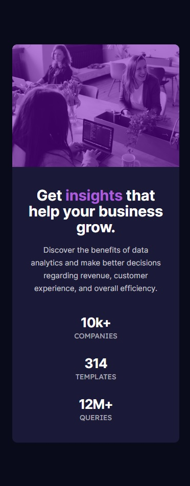

# Frontend Mentor - Stats preview card component solution

This is a solution to the [Stats preview card component challenge on Frontend Mentor](https://www.frontendmentor.io/challenges/stats-preview-card-component-8JqbgoU62). Frontend Mentor challenges help you improve your coding skills by building realistic projects.  

## Table of contents

- [Overview](#overview)
  - [The challenge](#the-challenge)
  - [Screenshot](#screenshot)
  - [Links](#links)
- [My process](#my-process)
  - [Built with](#built-with)
  - [What I learned](#what-i-learned)
  - [Continued development](#continued-development)
  - [Useful resources](#useful-resources)
- [Author](#author)

## Overview

### The challenge

Users should be able to:

- View the optimal layout depending on their device's screen size

### Screenshot
<div>
  
  
</div>

### Links

- Solution URL: [My solution URL](https://github.com/MiloosN5/FrontendMentor_NFTPreviewCard)
- Live Site URL: [My live site URL](https://miloosn5.github.io/FrontendMentor_NFTPreviewCard/)


## My process

### Built with

- Semantic HTML5 markup
- SASS - compiled into the CSS
- BEM
- Flexbox
- Grid
- Mobile-first workflow
- REM (Root EM) & EM (for Responsive)
- Responsive layout
- NPM
- JavaScript
- Webpack 

### What I learned

* This example helped you understanding responsive layout. The changes in the layout was made using both "breakpoints" (media-query) & "clamp function" (ex. for font-size).<br/>
**Note** For responsive image, media query was used with &lt;picture&gt; tag.

  * breakpoints 
    ```scss
        @mixin breakpoint($size) {
            @media (min-width: map-get(v.$breakpoints-up, $size)) {
                @content;
            }
        }
    ```
  * clamp function
    ```scss
        $margin: (
            // margin-inline
            'mi-0': 0,
            // margin-block
            'mb-0': 0,
            "mb-title": f.rem(4) clamp(f.rem(17), 0.85rem + 0.90vw, f.rem(24)),
            "mb-description": 0 clamp(f.rem(42), 1.78rem + 3.61vw, f.rem(70)),
            "mb-number": 0 f.rem(2)
        );  
    ```

  * responsive image
    ```html
        <picture class="stats__img">
            <source srcset="images/image-header-desktop.jpg" media="(min-width: 72.5em)">
            
          </picture>
    ```

* In order to have better project organization, solution was made with the help of Webpack. Using it, you can compile your source files, just like javascript -> typescript, sass/less -> css, but also handle images. Better organization is reflected in having 'dist' (distributon) folder with all source files compiled and also minified. You can build this folder when you are ready for 'production'. During the 'development', "webpack-dev-server" was used. For either "development" and "production" were used separate webpack configuration, as well as the one called "common".<br/>
**Note** When cloning this repo from GitHub, use "start" script for "development" and "build" for "production". "Build" will create 'dist' folder. Both scripts can be found in "package.json".

  * scripts
    ```json
        "scripts": {
          "start": "webpack-dev-server --open --config webpack.dev.js",
          "build": "webpack --config webpack.prod.js"
        }, 
    ```

* Sass organization was made through partials. There are files such as "mixins" and "functions" where you can create your own "templates" and later invoked them (like function/method). There is also file called "variables" where all values are stored.

  * mixin - example 
    ```scss
        @mixin flexbox($direction, $justify, $align, $wrap, $column-gap, $row-gap) {
            display: flex;
            flex-direction: map.get(v.$flex, $direction);
            justify-content: map.get(v.$flex, $justify);
            align-items: map.get(v.$flex, $align);
            flex-wrap: map.get(v.$flex, $wrap);
            column-gap: map.get(v.$flex, $column-gap);
            row-gap: map.get(v.$flex, $row-gap);
        }
    ```
    and invoking
    ```scss
        @include flexbox('fd-column', 'fjc-center', 'fai-center', 'fw-nowrap', 'cg-normal', 'rg-normal');
    ```

### Continued development

* In-depth explorating of Webpack & Sass.
* Aspiration to make better responsive layout.
* Aspiration to make better SASS organization.

### Useful resources

- [Webpack Course - Colt Steele (Youtube)](https://www.youtube.com/playlist?list=PLblA84xge2_zwxh3XJqy6UVxS60YdusY8) - Webpack configuration - really helpful to understand difference between 'development' & 'production' configuration. Also, comprehensible explanations and straight to the point.
- [Webpack - Official documentation](https://webpack.js.org/) - Webpack official documentation - everytime you struggle with understanding something about webpack (ex. plugins), there you can found explanation. 
- [BEM](https://en.bem.info/) - BEM naming convention is also really important for any projects, expecially the bigger ones.
- [SASS](https://sass-lang.com/documentation/at-rules) - You can found detailed documentation on the official page of the SASS. Check out for example "at-rules".
- [7-1 pattern SASS](https://sass-guidelin.es/#component-structure) - "7-1" pattern is one of the most used sass organization. It is also very pratical. 
- [Clamp calculator](https://royalfig.github.io/fluid-typography-calculator/) - Since there are so many different devices, desirable is to make your font fluid from one size to another.
- [Media Query](https://css-tricks.com/a-complete-guide-to-css-media-queries/) - A Complete Guide to (CSS) Media Queries.
- [Responsive images](https://developer.mozilla.org/en-US/docs/Learn/HTML/Multimedia_and_embedding/Responsive_images) - How to make images responsive.
- [Typographic Hierarchy](https://www.toptal.com/designers/typography/typographic-hierarchy) - Understanding your website structure/hierarchy sometimes can be difficult. Determing accurately typography can be half job done. 

## Author

- GitHub - [MiloosN5](https://github.com/MiloosN5)
- Frontend Mentor - [@MiloosN5](https://www.frontendmentor.io/profile/MiloosN5)


